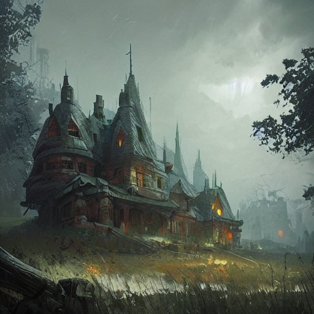

# TaleTunes

Hi,

TaleTunes will be an audiomixer and soundfx tool for tabletop roleplaying games. The idear is to make it a browserapp. Using the [YT Player API](https://developers.google.com/youtube/iframe_api_reference) to build an intuativ interface helping GMs to make smooth audio transitions between narrative events like battle, visions or themes and therefore create a more immersiv experience. 

The goal is to have an interface that enables the user to easily save, organize and manage groups of music- and ambience-video urls and control those groups, called "Tunes". Each "Tune" can be played, muted, faded in and out or set a volume to fade towards. I'd like the app to run locally, requiering no profiles or logins, by downloading a file and or using a cookie, containing a pool of one or multiple playlists, builds or "groups" and their video-urls. Side goal of this is to gain experience with GitHub, GIT, JS and softwaredevelopment in general, so feel free to give me advice.

